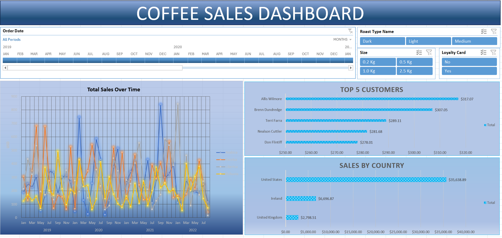

# Excel-Coffee-Orders-Dashboard
# ☕ Coffee Orders Excel Dashboard

### 📊 Overview

This project features an **Interactive Excel Dashboard** designed to analyze and visualize coffee sales data efficiently. The dashboard leverages Excel’s advanced tools like:

- **Pivot Tables** for data summarization
- **Slicers** for dynamic filtering
- **Formulas** such as `XLOOKUP`, `INDEX`, and `MATCH` for robust data lookups
- **Conditional Formatting** to highlight key trends
- **Charts and KPIs** for visual insights

---

### 🖼️ Dashboard Preview

---

### 🧠 Key Features

- **Dynamic Slicers**: Filter data by customer, region, product, or month
- **KPIs**: Displays Total Orders, Total Revenue, Average Order Value, etc.
- **Interactive Charts**: Explore trends over time and compare categories
- **Advanced Formulas**:
  - `XLOOKUP` for flexible lookups
  - `INDEX-MATCH` for dynamic referencing
  - Error-handling for clean summaries

---

### ⚙️ Tools & Techniques

- **Microsoft Excel (Desktop)**
- **Pivot Tables and Pivot Charts**
- `XLOOKUP`, `INDEX` & `MATCH` for dynamic data models
- **Slicers** for drill-down interaction
- **Conditional formatting** for visual emphasis

---

### 🧭 How to Use

1. Download or clone the repository
2. Open `coffeeOrdersData.xlsx` in Microsoft Excel
3. Interact with slicers to filter the data
4. Refresh pivot tables if data changes (Data > Refresh All)

---

### 🚀 Future Enhancements

- Integration with **Power Query** for automated ETL
- Adaptation of this dashboard in **Power BI**
- Additional visuals like heatmaps or advanced charts

---

### 💬 Feedback & Contributions

Feel free to fork this repo, suggest improvements, or share feedback via issues or pull requests.

---

👨‍💻 Created with passion using Excel's powerful analytics tools.

---
